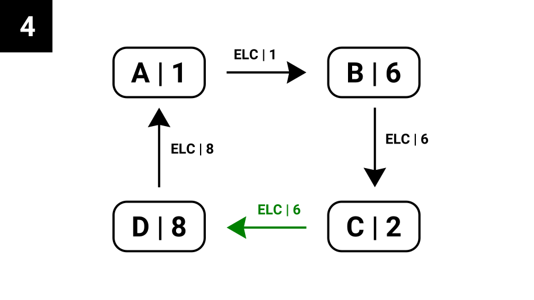

# 1. Introduction

The project is focused on designing and implementing a gRPC-based network of server computers capable of communicating with each other over a ring topology. Achieving this goal requires multiple computers, network switches, and Cat-5 LAN cables to set up a reliable and resilient network. It is crucial to note that the project explicitly forbids the usage of Wi-Fi connectivity. Each participating team is entrusted with the development of an autonomous and self-contained mini-system that can effectively achieve the stipulated goals. Moreover, the project mandates strong integration and collaboration among the teams to create a unified and expansive distributed computing solution.

## 1.2. Scope

Development of a server-side Java CLI program that is able to read configuration files to send message streams over gRPC to specific servers.
Implementation of different types of messages and queries in order to facilitate node-node communication.
Cooperation between teams for consensus on a standard for inter-team communication 
Live demonstration of the grand challenge to highlight the system's capabilities in handling data streams, adapting to changing conditions, achieving efficient data redistribution, query processing, and fault tolerance.

## 1.3. Hardware Requirements

Multiple Computers: The project requires the utilization of at least 3 computers to demonstrate a unidirectional ring topology.
Switches: Multiple switches are necessary to establish the network infrastructure for connecting the team's systems. Per team, there would be only one switch required. As a requirement, wireless access points are not allowed for this challenge.
Physical Wiring: High-quality physical wiring, preferably Category 5 or higher, is essential for establishing reliable and fast connections between the computers and switches.
Servers: The servers should have sufficient processing power, memory, and storage capacity to handle the workload and 
data processing requirements.

# 2. Exchange Types

In the world of computing, communication requires some standards to be enforced and followed. In our case, without a standard, nodes would not be able to comprehend incoming messages to then perform processing. We have developed our own standard to channelize messages as well as queries.

## 2.1. Message Types

Messages can be of different types that let a server process it accordingly. Moreover, some messages are supposed to be processed by servers of specific roles. For example, messages can be heartbeats which are processed by every receiving server, regardless of their role. However, messages can be responses, which are only processed by leaders, whereas non-leader members simply relay such messages further in the ring.

| Enum | Description |
| --- | --- |
| HBT | A heart-beat type of message that flows unidirectionally to let the next server know of this server’s existence. |
| ELC | An election type of message that informs the next server that a leader election has started along with the rank of the previous server. |
| QRY | A query message that can be of any type (see next section). |
| RES | A response message that can only be initiated by a member and acted upon by a leader. |
| RNG | A ring restoration message initiated by a node that has not heard from the previous node in the ring for over 5 seconds. |

## 2.2. Query Types
We have used different types of queries that occupy the first 3 bits of every query message payload. They are summarized as follows:

| Query Enum | Query Description |
| --- | --- |
| EXT | Query messages coming in from other teams over the network |
| FND | Initiated by the leader node to query CSV records stores in each member node |
| CPU | Initiated by the leader node to query the core count of each member node |
| ETL | Initiated by the leader to perform data extraction, transformation and load (by load balancing) across member nodes on the network |
| DST | (redundant) Initiated by the leader to query to disk space of each member node |
| LST | Initiated by the leader to list and count the number of nodes on the network |

# 3. Architecture

Our gRPC network setup follows a ring topology. More specifically, we arranged 4 servers in the shape of a ring in which communication is unidirectional and all information flows only one way. Though acknowledgements flow backward, all responses move ahead in the network until they reach the node that initiated the activity in question. Additionally, we have also ensured that our system supports leader election, fault tolerance (in case of failing servers in the ring), ETL, as well as query processing. This section aims to illustrate these features.

## 3.1. Peer Discovery

In distributed systems, nodes are individual units of a larger network, and their interconnection forms the backbone of the system. The connections between nodes enable them to communicate and share resources efficiently, ensuring seamless system operation.

A node connection mechanism is crucial for the functioning of a distributed system, as it facilitates the transfer of data, the execution of tasks, and the replication of information across nodes, thereby enhancing the overall performance and reliability of the system.

Initially, servers within the ring are hardwired to look for and connect to specific servers. This information is contained in the respective servers’ configuration files that get loaded at the time of the server engine initialization. 

For example, in the below ring setup, server-A attempts to connect to server-B the moment A is online and initialized. It remains in this infinite loop of searching for the presence of B on the network and connecting to it. Until B is online, server-A performs busy waiting and once it manages to establish a connection with B, it’ll then move on with the next activity.

## 3.2. Leader Election

In a distributed system, the coordination of Extract, Transform, Load (ETL) operations and data querying across various nodes is performed by a selected "leader". This leader ensures efficient data management and system coherence. The need for a leader arises to prevent operational conflicts and maintain consistency across all nodes in the system.

The leader election is performed democratically in order to choose the best node, in terms of processing capability, as the leader. The leader should carry more processing power as compared to other nodes on the network as leaders are exposed to the outside world and are responsible for some exclusive administrative responsibilities such as ETL and query management that we will see in subsequent sections.

Adding on to our previous example, once server-A manages to establish connection with server-B, it will immediately start the election process. As part of the election message, server-A will pass on its priority, which is essentially its rank. For the sake of the demo, we set the rank to be a randomized number, generated when each server initializes. In the real world, the rank would be a function of a server’s disk, memory, and processing capacity.

Extrapolating this case, you can imagine that every server, once online, would start an election process. WIth so many new election requests in the network, the ring would take longer than required to stabilize with an elected leader. This is exactly why we baked into the payload a timestamp attribute that would indicate the time at which this election was started. Every node would then compare the timestamp of its own election message (that it already injected into the ring) with the one that just arrived from the previous node. If the previous node’s election message was initiated earlier in time, the node in question would transmit the older election message, with the older timestamp, but with the updated priority (which is the result of comparing its own priority with that in the incoming election message).

Lets update our example with the individual server priorities to get a clearer understanding.

With that done, let's see what happens when each server calls out an election with its own priority before hearing from previous members.

Nevertheless, each node, moments after calling out an election, hears from the previous node with an election message that is older in time. Since the incoming election message is older, the node passes on that election message with the updated priority (by comparing the older priority with the current node’s priority). Here is an illustration from server-C’s frame of reference:

Notice that server-C is aware that the incoming election message from server-B is older in time and that it should pass that on ahead by updating the priority. Conversely, if a server receives an election message with an older timestamp, it will simply drop it and not transfer it ahead in the ring.

The process of choosing this leader is streamlined and summarized through a specialized algorithm with is quite related to the Bully Algorithm for leader election:
1. Election initiation: When a process detects that the leader has failed, it starts an election. The process sends an ELECTION message to all processes with higher IDs.
2. Respond to election message: Any process that receives an ELECTION message responds with an OK message and starts its own election round.
3. Determine the winner: If a process gets no OK message in response (implying it has the highest ID among currently running processes), it wins the election and becomes the leader. The new leader announces its status by sending a COORDINATOR message to all other processes.
4. Leader acknowledgement: On receiving the COORDINATOR message, all the other processes update their leader ID.

## 3.3. ETL

In distributed systems, Extract, Transform, Load (ETL) is a fundamental process that handles data management across nodes. ETL involves extracting data from various sources, transforming it into a consistent format, and loading it into a target destination. In our case, we are storing the data on various nodes based within the ring network.

The ETL process generally consists of three stages:
1. Extraction: This step involves retrieving raw data from various source systems. In our case the leader node receives a String of bytes of data.
2. Transformation: Once the data is extracted, it's often in different formats and standards. During the transformation phase, this data is cleaned, validated, and reformatted into a unified structure. In our case, we convert that stream of data into a CSV file, stored on the disk, and then send it as a stream to other nodes on the network.
3. Loading: After the data is transformed into a consistent format, it's loaded into the target. In our case, the data is loaded into a CSV file in each node and additionally into the 

## 3.4. Query Execution

Query execution in distributed systems refers to the process of retrieving specific data from the distributed databases across various nodes based on specific criteria. This is a core operation that enables the system to extract meaningful information from the data and use it for various analytical tasks. Efficient query execution mechanisms are essential for ensuring quick response times, accurate data retrieval, and overall system performance.

# 4. Integration

Even though we implemented a ring topology for our team’s set of server computers, we had to integrate our team’s setup with other teams to synergise. Basically, this is a “network of networks” in which a remote client can initiate a query at a certain team, which will then flow throughout the network of team leaders and then team members. The outer architecture (network of teams) is topology-agnostic and does not demand a certain network topology to be followed by participating teams.

## 4.1. Intra-team

1. Each server is equipped with a configuration file which points it to the next server on the ring.
2. Servers use unary RPC in gRPC to open channels with neighboring server computers.
3. Messages are sent either on priority, which is immediately, or enqueued for send. A background thread takes care of de-queueing messages and issuing a send.
4. Once messages are received, immediately, acknowledgements are prepared and sent back to the issuing server.
5. All messages will flow in one direction as the ring is unidirectional.

## 4.2. Inter-team

Collaborating with other teams was more than just the standards that we had laid out for ourselves. Different teams had different topologies and standards for intra-team communication, which clearly would not be entirely compatible with other teams’ setups.

From various brainstorming sessions and meetups with other teams, we all arrived on using Apache ZooKeeper as a centralized server to facilitate team discovery. This is broadly similar to how DNS servers work. The ZooKeeper server would store information about every leader node on the network of networks and facilitate teams to establish communication channels with the leader nodes of other teams in order to perform ETL or query processing.

### 4.2.1. Challenges Encountered

Challenges are inevitable when establishing communication between teams! Most teams had their own unique standards and setups for communication and we had to wade through these differences.

A major challenge we faced in inter-team integration was in the message format. Each team had their own message format. After some discussions, we realized that we had a novel, organized, and unique approach towards message management. Though all teams worked within the bounds of the same .proto file, we handled messages of different types as outlined in one of the previous sections. In contrast, other teams played around with the path field of the .proto file to handle two different types of queries - “query” and “upload”. To walk around this, we had to include some additional query handling to look beyond just the payload attribute. Below is an incoming ETL query from another team, as captured in a raw format on one of our server computers, requiring further processing and handling:

Overcoming these challenges required collaborative problem-solving and effective communication. Our team actively engaged with other teams to understand their query formats and establish a standardized approach to query types.

# 5. Testing

The testing phase confirmed the successful implementation and functionality of our integrated ring topology and query exchange mechanism. The system exhibited efficient query routing, seamless collaboration between teams, and fault tolerance.

At the time of development, a single node setup was used to test the project and make changes incrementally. Moving into the wild world of independent computers saw a stark difference. A lot of things that were assumed to work at the time of development now failed. We had to then get back to bug fixing and testing. This phase of the project incurred significant efforts and probably was even more challenging than inter-team integration!

Once our ring was fully functional, we extended the system to support the languages that the other servers spoke in. Once those standards were imbibed, we then began testing our ring with other teams’ setups. Though this phase was challenging, we had fun interacting with other teams and having both meaningful conversations and occasional break-out sessions in the library.

An important aspect of distributed computing is fault tolerance. The scope for nodes failing and topologies getting disrupted in the process is very high in the case of distributed systems as everything is asynchronous and also not in one single place. More specifically, the ring topology, especially a unidirectional setup, is susceptible to easily failing if even one node on the network dies. For example, in the below setup, if server-C fails, how would server-B ever know about the existence of server-D and consequently route a connection to D?

That is exactly when we came up with the solution of heartbeats, which would be sent every second by each server on the network to the next server in the ring informing its existence. In the above example, when server-D would not hear from C in 5 seconds, D would then issue a “ring restoration” type of message that would flow in the network until received by B that manages to restore the ring by connecting to D.

# 6. Guide to Repo

https://github.com/theGeekyLad/cmpe275-gc1

# 7. Contribution

| Team Member | Contribution |
| --- | --- |
| Ira | ETL |
| Faizan | Leader election |
| Rahul | Query management |

# 8. Conclusion

In conclusion, our project showcased the immense value of collaboration and integration within distributed computing. By establishing a larger ring topology that encompassed three other teams, we significantly bolstered the capabilities and scalability of our system. The successful implementation of cross-team query functionality enabled seamless communication and data exchange, unlocking new possibilities for collaboration and resource utilization. Although we encountered challenges with different query formats and transmitting larger query chunks, our team's effective problem-solving and communication ensured their resolution.

Through rigorous testing and validation, we verified the reliability, efficiency, and fault tolerance of our distributed computing solution. The project's success not only solidified our team's technical expertise but also highlighted our commitment to pushing the boundaries of what is achievable in distributed computing. As we move forward, we will continue to optimize and enhance our system, leveraging our experience and lessons learned to further advance the field of distributed computing. Our dedication to innovation and collaboration positions us as leaders in this evolving domain, poised to shape the future of distributed computing systems.

# 9. Future Work

The successful implementation of the ring topology and cross-team query functionality in our distributed computing system opens up exciting avenues for future work. Here are some areas that can be explored:
1. Enhanced Ring Management: Further research can be conducted to optimize the management of the ring topology. This includes developing advanced algorithms for dynamic ring reconfiguration, fault tolerance mechanisms, and load balancing techniques to ensure optimal utilization of resources and efficient communication within the ring.
2. Advanced Query Optimization: Building upon the query system we have developed, future work can focus on enhancing query optimization techniques. This involves investigating algorithms and strategies for optimizing query execution across multiple teams, reducing latency, and minimizing resource utilization while maximizing system performance.
3. Integration with Big Data Technologies: With the increasing volume and complexity of data, integrating our distributed computing system with big data technologies such as Hadoop, Spark, or distributed databases can further enhance its capabilities. This would enable efficient processing and analysis of large-scale datasets, opening up possibilities for advanced data-driven applications and insights.
4. Cloud Integration and Elasticity: Exploring the integration of our distributed computing system with cloud services can provide additional scalability and elasticity. Future work can involve designing mechanisms for seamless integration with cloud platforms, enabling dynamic resource allocation and efficient utilization of cloud resources to meet varying computational demands.
5. Experimentation and Benchmarking: Conducting thorough experiments and benchmarking studies can provide valuable insights into the performance and scalability of our system. Future work can involve designing comprehensive experiments, defining relevant metrics, and comparing the performance of our system against other distributed computing frameworks to identify areas for improvement and fine-tuning.

By pursuing these future directions, we can continue to advance the capabilities, scalability, and performance of our distributed computing system. These efforts will contribute to the broader field of distributed computing and open up opportunities for solving complex computational problems in various domains more efficiently and effectively.

# 10. References

1. Bully Algorithm: https://www.educative.io/answers/what-is-a-bully-election-algorithm
2. gRPC Java Docs: https://javadoc.io/doc/io.grpc/grpc-api/latest/index.html
3. gRPC Source Code: https://github.com/grpc/grpc-java
4. Saikat Ray, Roch A. Guérin, and Rute Sofia, "A Distributed Hash Table based Address Resolution Scheme for Large-scale Ethernet Networks", . June 2007
